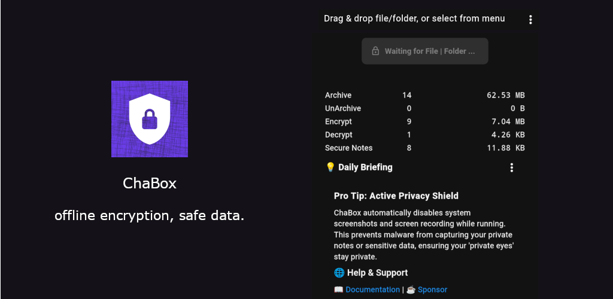

  
  

  
  

  

# ChaCrypt - Modern High-Performance Offline File Security Ecosystem

**English** | [Chinese](./README_zh.md)

**ChaCrypt** is an "Offline-First" file security ecosystem designed to protect your data sovereignty. In an era where the Internet is an "insecure highway" filled with surveillance, interception, and leaks, ChaCrypt provides a local fortification to secure your sensitive information before it ever leaves your machine.

## 🛡 Why ChaCrypt? The Philosophy

"Offline-First, Data Sovereignty" is not just a slogan; it is a defense line built against the biggest security risks in modern data flow:

1.  **Online Transmission Security**: Sensitive data must be reinforced locally before entering insecure channels such as instant messaging, cloud drives, or email. Ensuring that data is encrypted before it leaves your device is the only way to prevent eavesdropping, interception, and leaks at the source.
2.  **Offline Storage Security**: Provides "cold protection" for sensitive assets on local disks, NAS, or mobile media. In cases of physical device loss or unauthorized access, the ChaCha20-Poly1305 standard ensures that data sovereignty is never violated.

ChaCrypt operates on a **Zero-Trust Local** principle:
*   **Local Security Reinforcement**: Adheres to the "Fortify First, Transfer Later" rule; security does not rely on the promises of third-party providers.
*   **Memory-Level Processing**: We avoid writing temporary plaintext files to disk. Decryption, previewing, and editing happen in RAM whenever possible to prevent physical data fragments.
*   **Transparency & Auditability**: Using a "Stacked Extension" strategy (e.g., `.tgz.cha`), you can instantly see the exact processing chain (Archived -> Compressed -> Encrypted).

## ⚡ The Standard: ChaCha20-Poly1305 (AEAD)

We exclusively use the **ChaCha20-Poly1305** standard for all operations. Why?
*   **Extreme Performance**: Compared to AES, it has an overwhelming advantage in software implementation, especially on mobile devices and for massive data (GB/TB scale) transfers.
*   **Physical-Grade Integrity**: As an AEAD algorithm, it provides a tamper-proof signature for every offline asset. If a file loses a single bit on disk due to hardware failure or malicious modification, decryption fails immediately, ensuring the reliability of stored data.
*   **Modern Industry Standard**: Adopted by Google and the Linux kernel, it is the modern foundation for high-performance security.

## 🛠 The Ecosystem

ChaCrypt provides two specialized tools to serve every type of user, from personal privacy seekers to DevOps professionals.

### 1. [ChaBox](./chabox) - The Personal Secure Vault (GUI)
*Target: Ordinary users and Power users.*
ChaBox is a visual workstation for those who prefer an intuitive, "one-click" experience.
*   **Five Atomic Tools**: Integrated Batch Archive, Batch Unarchive, Batch Encrypt, Batch Decrypt, and Digital Shredder for the full data lifecycle.
*   **Secure Notes (One of the Core Capabilities)**: Built on immersive Markdown writing and real-time preview, ChaBox further supports variable-based references and encrypted embedded images (local and remote HTTP sources), combining smooth note-taking with unified encrypted protection for both note text and attached images while reducing migration friction across devices.
*   **Active Defense**: Integrated App Lock, Idle Lock, Anti-Screenshot, Full-Platform Anti-Recording, and Screen Masking for privacy.
*   **Physical Destruction**: Built-in industrial-grade file wiping to destroy original sensitive data.

### 2. [Chapose](./chapose) - The High-Performance Guardian (CLI)
*Target: Developers, Experts, and Automation.*
Chapose is a lightweight, professional-grade tool for those who live in the terminal.
*   **Pure Streaming Architecture**: Optimized for massive data and low-memory environments.
*   **Invisible Workflows**: Seamlessly integrates into CI/CD pipelines via environment variables.
*   **Orchestration**: Works with `ft:filetools` for complex, automated security audit chains.

## 📸 Screenshots
Showing the three beginner-friendly core features.   
[View the full gallery on our Screenshots Page](chabox/doc/img/README.md).

<table align="center">
  <tr>
    <td></td>
    <td></td>
    <td></td>
    <td></td>
    <td></td>
  </tr>
  <tr>
    <td align="center">All-in-One Privacy Workspace</td>
    <td align="center">One-Step Drag-and-Drop Encryption</td>
    <td align="center">Encrypted Secure Notes Management</td>    
    <td align="center">Real-Time Markdown Preview</td> 
    <td align="center">Deep Secure Erase</td>        
  </tr>
</table>

## 🚀 Installation

Prefer not to build from source? Precompiled binaries are available for both ChaCrypt applications:

### ChaPose (CLI)
See the [Chapose documentation](./chapose/README.md) for the quick binary installation method.

### ChaBox (GUI)
Prebuilt installers are available for `Windows`, `macOS`, `Linux`, `Android`, and `iOS`. Download the appropriate package from the [ChaBox download page](https://webpath.iche2.com/app/chabox/download_en.html).

## 📖 Documentation & Support

Detailed technical guides, configuration manuals, and FAQs are located within the `doc/` directory of each sub-project. 

*   [ChaBox Documentation](./chabox/README.md)
*   [Chapose Documentation](./chapose/README.md)

## 💖 Support the Project
If you find this tool helpful and would like to see it continue to improve and evolve, please consider showing your support.

*   ⭐ **Star the Repo**: This is a great encouragement. Your stars help more people discover this tool and gain more recognition in the community.
*   ☕ **Support the Developer (Global)**: Any contribution, however small, is a huge affirmation of my work. You can support via [GitHub Sponsors](https://github.com/sponsors/huanguan1978) or [Buy Me a Coffee](https://buymeacoffee.com/huanguan1978).
*   🐼 **Support via Ifdian (Mainland China)**: Users in China can also show support via [Ifdian](https://ifdian.net/a/huangaun1978).

*Thank you for your support, which is a vital boost that keeps me focused on the project's continuous iteration; because of you, more people can benefit from this tool much sooner.*

## ⚖️ License & Philosophy

*   **Build for Yourself, Encourage Contribution**: We support forks and customization for unique workflows, and highly encourage developers to contribute features of general value back to the main repository.
*   **License**: Source code is open-sourced under the [PolyForm Noncommercial 1.0.0](./LICENSE) license.
