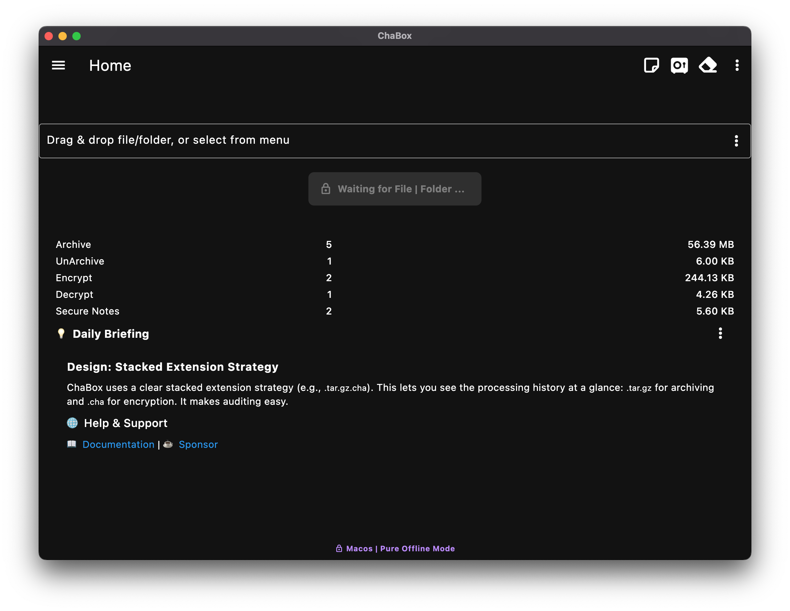
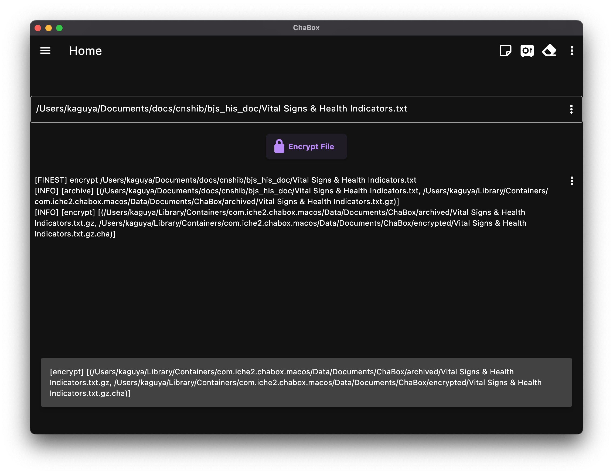
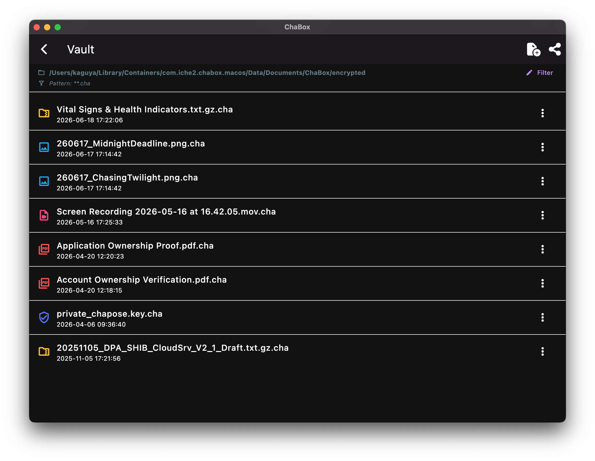
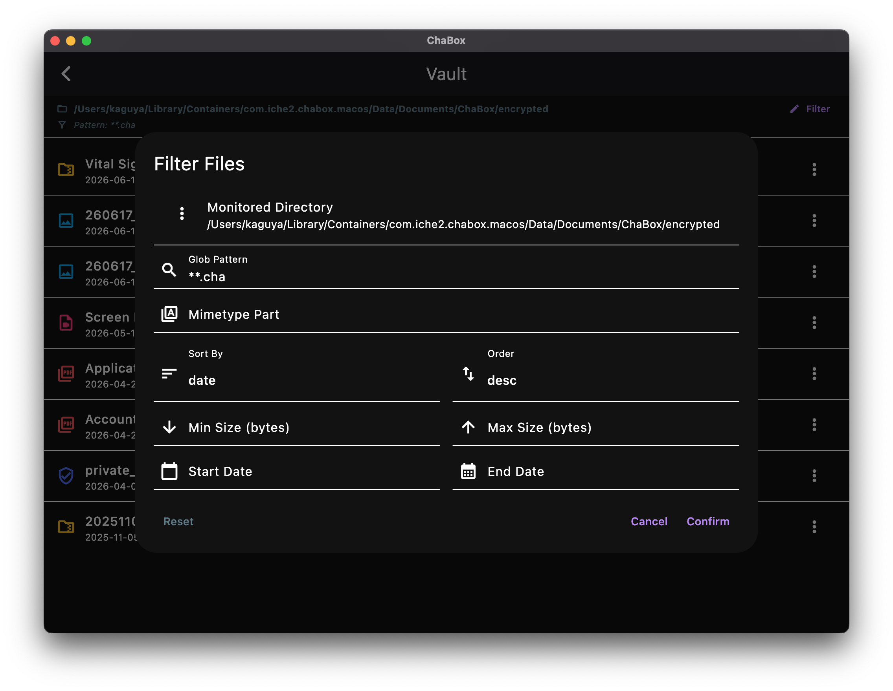
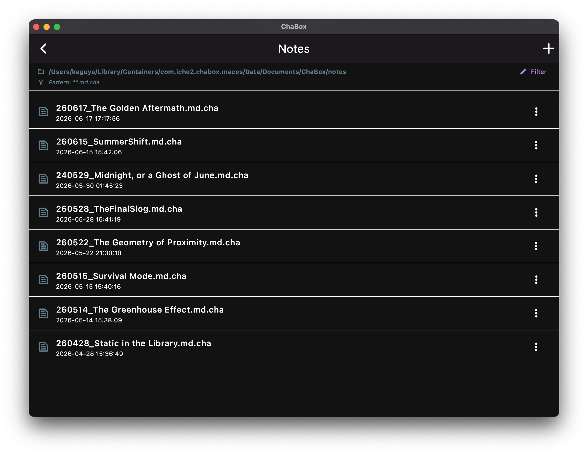
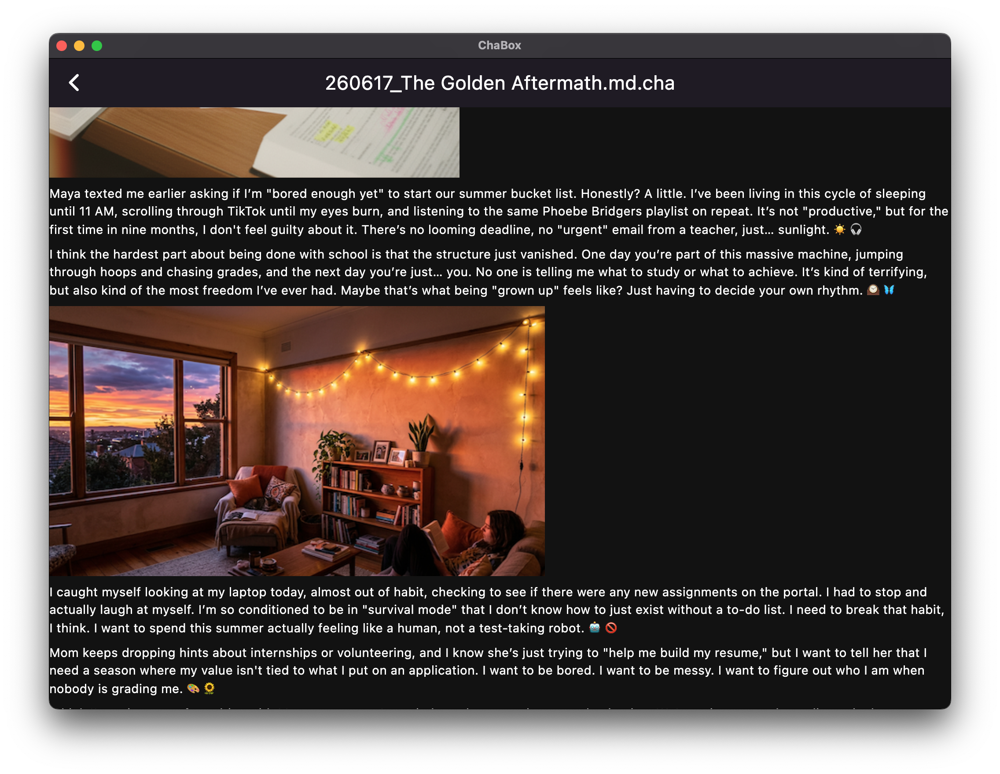
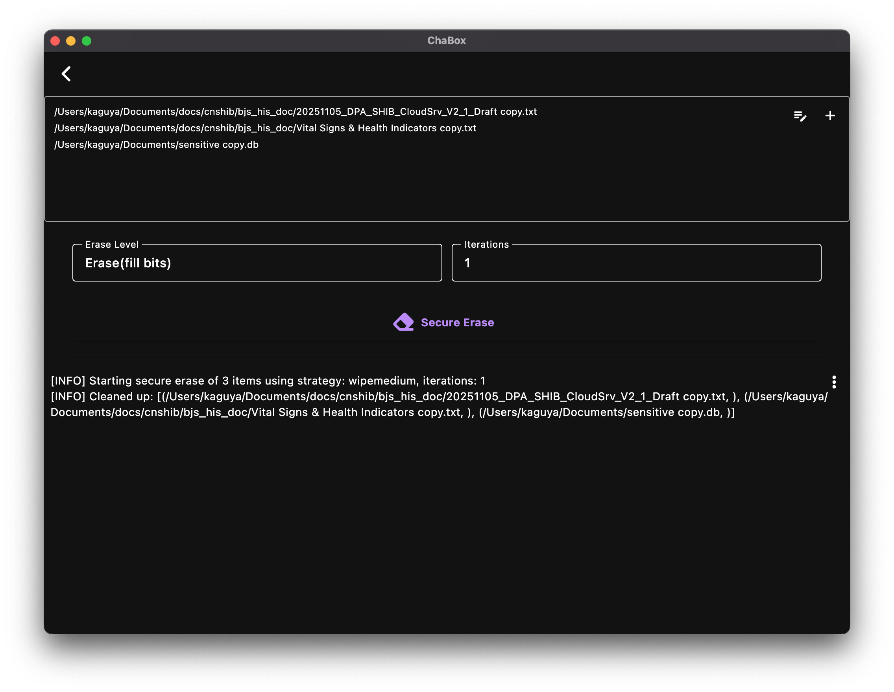
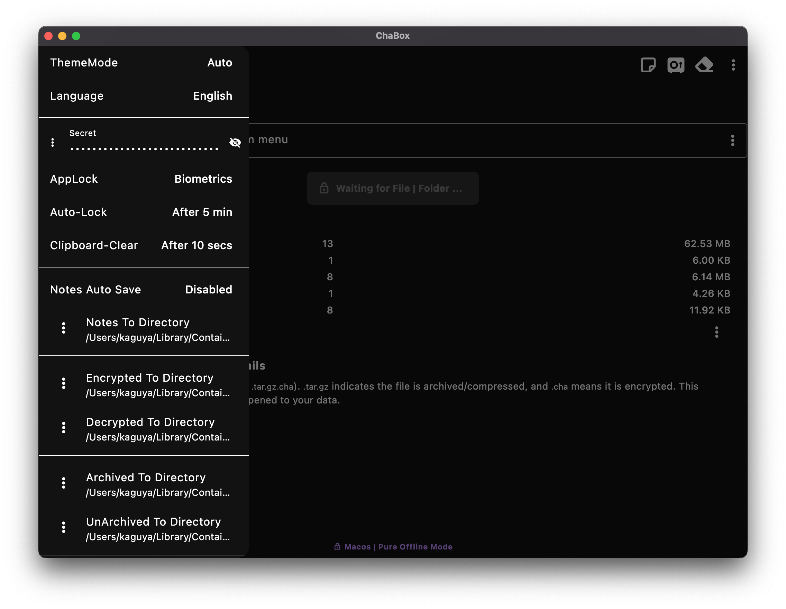
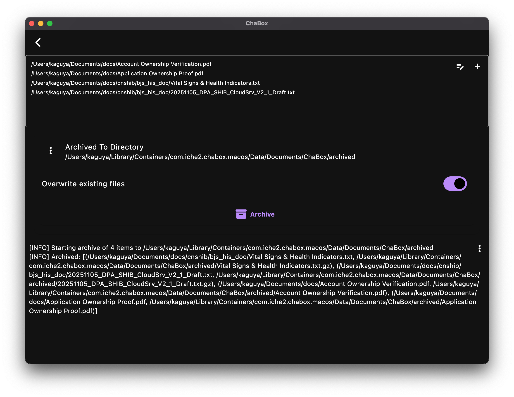
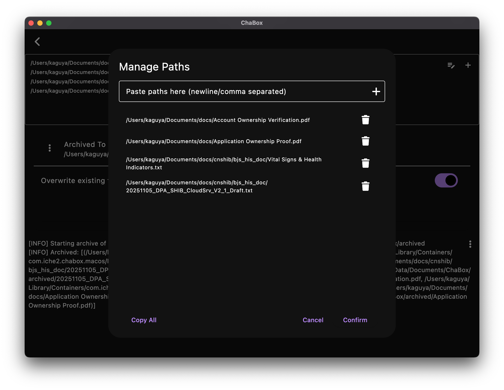

## ChaBox Screenshots

All-in-One Privacy Workspace:
Encrypt files, use Secure Notes, and run Secure Erase from one home screen for a streamlined privacy workflow.

One-Step Drag-and-Drop Encryption:
Drag in files for automatic detection and one-step encryption to protect sensitive data quickly.

Encrypted Files at a Glance:
File Vault offers visual listing and categorization for centralized viewing and management of encrypted files.

Multi-Criteria File Filtering:
Filter by path, type, size, and time to locate target files accurately, even in large datasets.

Encrypted Secure Notes Management:
Keep private notes encrypted in one place with a clear, efficient list-based management view.

Real-Time Markdown Preview:
Write and preview Markdown in real time within a secure environment for a better private note-taking experience.

Deep Secure Erase:
Use deep overwrite-based Secure Erase to remove sensitive files and reduce recovery risk.

Centralized Security Settings:
Manage passwords, lock settings, and anti-leak protections in one settings center for safer daily use.

Controlled Batch Archiving Workflow:
The Archive tool provides a standardized workflow for more efficient and controllable batch processing.

Fast Batch Source Configuration:
Import and edit source paths in batch to reduce preparation time before execution.

