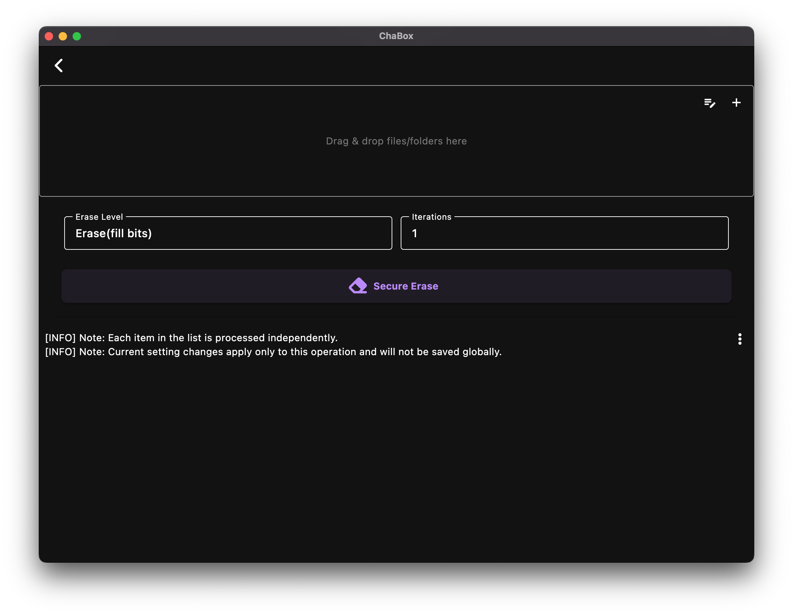

# 1. 快速入门：开启您的隐私防护之旅

欢迎使用 ChaBox！这是一个专为保护您个人私密数据（如证件照、财务报表、私人日记、各类敏感数据等）而设计的“离线数字保险箱”。

---

## 1.1 认识您的首屏工作台

当您打开 ChaBox，首先映入眼帘的是功能丰富的主界面。为了让您的日常操作清晰高效，整个界面采用了直观的区块布局，各功能入口一目了然：

*   **顶部工具栏**：右上角集成了高频工具的快捷入口（安全日记、文件保险箱、安全擦除）以及更多功能下拉菜单，触手可及。
*   **左侧抽屉式菜单**：点击左上角的三横线菜单图标，可以展开侧边控制中心。在这里您可以进行全局配置，如多语言切换、密码管理（导入/导出）和输出目录设置等。
*   **主工作区**：
    *   **上部 - 便捷加解密区**：应用的核心区，直接把文件拖进来即可自动感应。
    *   **中部 - 数据统计区**：直观展示您当前加密文件和保险箱中的文件统计状态。
    *   **下部 - 每日简报区**：显示安全提醒、使用小贴士或每日动态。

---

## 1.2 便捷的一键加解密

“便捷”是 ChaBox 首页一键加解密功能的核心特色。它具备智能感应能力，无需手动切换模式：

*   **极简加密**：直接将需要保护的文件或文件夹拖入首页，系统感应到普通内容后，操作按钮会自动变为 **“加密所选项目”**。
    *   *小白贴士*：如果是文件夹，ChaBox 会自动打包并生成 `tar.gz.cha` 加密包。
    *   *被动学习解密*：一旦您拥有了加密后的 `.cha` 文件，需要还原时只需将其重新拖回此处，按钮便会自动切换为 **“解密所选项目”**。您只需学会加密，解密过程自然一目了然。

---

## 1.3 随手记：您的私密安全日记

ChaBox 提供了强大的私密记事本功能（支持桌面端与移动端应用）。

*   **设备本地存储（安全核心）**：**所有的日记均以高强度加密文件形式保存在用户当前设备上**，不依赖任何第三方云端。您的隐私数据，由您的设备物理级完全自主掌控。
*   **沉浸式 Markdown 写作**：提供简洁干净的 Markdown 编辑环境，支持即写即存，且日记在编辑和预览时优先使用安全内存，最大限度防范硬盘痕迹残留。
*   **变量占位增强**：Markdown 支持应用变量与自定义变量，图片路径和网页链接可集中管理，跨平台迁移时只需调整变量即可快速适配。
*   **密文附图增强**：Markdown 支持本地与 HTTP 远程密文图片，笔记正文与附图可实现统一密文保护。
*   **实时效果预览**：可通过预览功能实时检查排版效果，完美适配桌面与移动端屏幕。

*提示：在日记列表页，点击左上角的“+”号按钮即可新建日记。*

*预览模式能够清晰地展示您的 Markdown 排版效果。*

---

## 1.4 安全擦除：彻底销毁不留痕迹

普通删除只是将文件标记为删除，在物理介质上仍可被数据软件恢复。ChaBox 的“安全擦除”是您的数字碎纸机：

*   **本地物理销毁**：直接针对您当前设备上的物理文件进行深度覆盖。支持批量拖入或选择多个项目。
*   **自主调节强度**：您可以在操作前微调 **擦除级别（覆盖算法）** 和 **写入次数**，通过增加覆盖轮次进一步提升防护强度，确保数据物理不可复原。
*   **移动端提示**：移动端受 Android / iOS 沙盒限制，ChaBox 只能访问并安全擦除应用自身沙盒内的文件。

---

## 1.5 您的数字生命线：安全密码

在您开始第一次加密前，请务必关注您的密码：

*   **自动生成**：ChaBox 首次启动时会为您生成一个高强度的随机本地密码。
*   **本地独立存储**：密码仅加密存储于您当前使用的设备本地，不依赖云端账户，防范云端泄漏风险。
*   **备份备份再备份**：这是最核心的提醒！请通过 **左侧抽屉式菜单** 中的密码管理，将密码“导出到文件”并保存在安全的物理媒介（如 U 盘）中。如果密码丢失且没有备份，您设备上所有的加密文件将永远无法恢复。

---

**下一步：** [配置您的私人工作站 (应用设置)](./settings.md)
